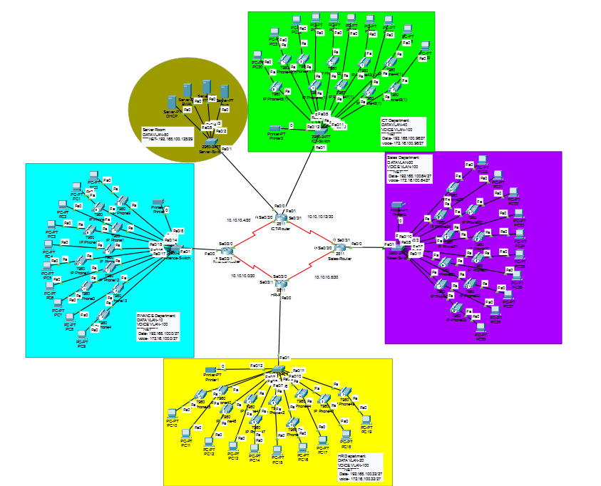

# 🌐 Enterprise VoIP Network Infrastructure Project

  <b>Enterprise-Level Voice & Data Network Implementation</b> 
  Cisco Packet Tracer | OSPF | VLAN | CME | Dial-Peering | DHCP

---

## 📌 Project Summary

This project demonstrates the complete design and implementation of a scalable **Enterprise VoIP Network Infrastructure** integrating voice and data communication using Cisco technologies.

The network simulates a real-world corporate environment (Turtle Consultancy Limited) consisting of four departments interconnected via WAN serial links and dynamic routing.

The implementation follows structured enterprise networking practices including VLAN segmentation, IP subnetting, inter-VLAN routing, VoIP deployment using Call Manager Express (CME), and dial-peering configuration.

---

## 🏢 Enterprise Network Architecture

### Departments Implemented

- Finance Department
- Human Resources Department
- Sales Department
- ICT Department

Each department includes:

- 1 Cisco 2811 Router
- 1 Cisco 2960 Switch
- 10 IP Phones
- 10 Desktop PCs
- 1 Network Printer

Centralized server room provides:

- DHCP Server
- DNS Server
- Email Server
- HTTP Server

---

## ☎ VoIP Deployment Details

VoIP is implemented using Cisco Call Manager Express (CME) on routers.

### Implemented Features:

- IP Phone Registration
- Extension Assignment
- Voice VLAN Configuration
- DHCP Option 150
- Dial-Peer Configuration
- Inter-Department Calling
- Structured Dial Plan

### Extension Plan

| Department | Extension Range |
|------------|-----------------|
| Finance    | 101 – 199 |
| HR         | 201 – 299 |
| Sales      | 301 – 399 |
| ICT        | 401 – 499 |

---

## 🌐 Network Segmentation (VLAN Design)

| VLAN ID | Purpose |
|---------|---------|
| 10 | Finance Data |
| 20 | HR Data |
| 30 | Sales Data |
| 40 | ICT Data |
| 100 | Voice VLAN |

Benefits:

- Logical traffic separation
- Improved performance
- Enhanced security
- Better VoIP quality

---

## 🔀 Routing & WAN Design

- Dynamic Routing Protocol: **OSPF**
- WAN Addressing: /30 Subnets
- Automatic Route Learning
- Scalable Multi-Router Design

OSPF ensures efficient path selection and fast convergence between departmental routers.

---

## 🧮 IP Addressing Structure

- Data Network: 192.168.100.0/24 (Subnetted per department)
- Voice Network: 172.16.100.0/24
- WAN Network: 10.10.10.0/30
- Server Network: /29 Subnet

Structured subnetting ensures optimized IP utilization and scalability.

---

## 🔒 Security Implementation

- SSH Remote Access
- Encrypted Passwords
- Console & Enable Security
- VLAN Segmentation
- Controlled Inter-VLAN Routing

---

## 📷 Network Topology

  

---

## 🧪 Testing & Verification

✔ PC-to-PC Communication  
✔ Phone-to-Phone Calls  
✔ Inter-Department VoIP Communication  
✔ DHCP Address Allocation  
✔ OSPF Neighbor Establishment  
✔ Server Accessibility  

All services tested successfully.

---

## 🛠 Technologies & Skills Demonstrated

- Enterprise Network Design
- Cisco Router & Switch Configuration
- VoIP Implementation
- Call Manager Express (CME)
- Dial-Peering
- OSPF Routing
- VLAN & Trunking (802.1Q)
- Inter-VLAN Routing
- DHCP & DNS Configuration
- Subnetting & IP Planning
- WAN Serial Configuration
- SSH Remote Management

---

## 🎯 Learning Outcome

This project demonstrates practical implementation of:

- Real-world enterprise VoIP infrastructure
- Dynamic routing in multi-router environments
- Voice and data integration
- Structured IP address planning
- Professional network documentation

---

## 📂 Repository Structure
VoIP-Enterprise-Network/  
│  
├── Enterprise-VoIP-Network.pkt  
├── README.md  
├── Project-Report.pdf  
├── topology.png 

## 👨‍💻 Author

**Saim Ali Shahid**  
Computer Networks | VoIP Implementation  
Aspiring Network Engineer  

---

## 📚 Academic Purpose

This project was developed as part of a Computer Networks course to simulate enterprise-level VoIP deployment using Cisco technologies.

---

⭐ If you found this project useful, consider giving it a star.

## 📥 Download Project Files

- [Packet Tracer File](Enterprise-VoIP-Network.pkt)
- [Project Report](project-report.pdf)

## 📂 Repository Structure

